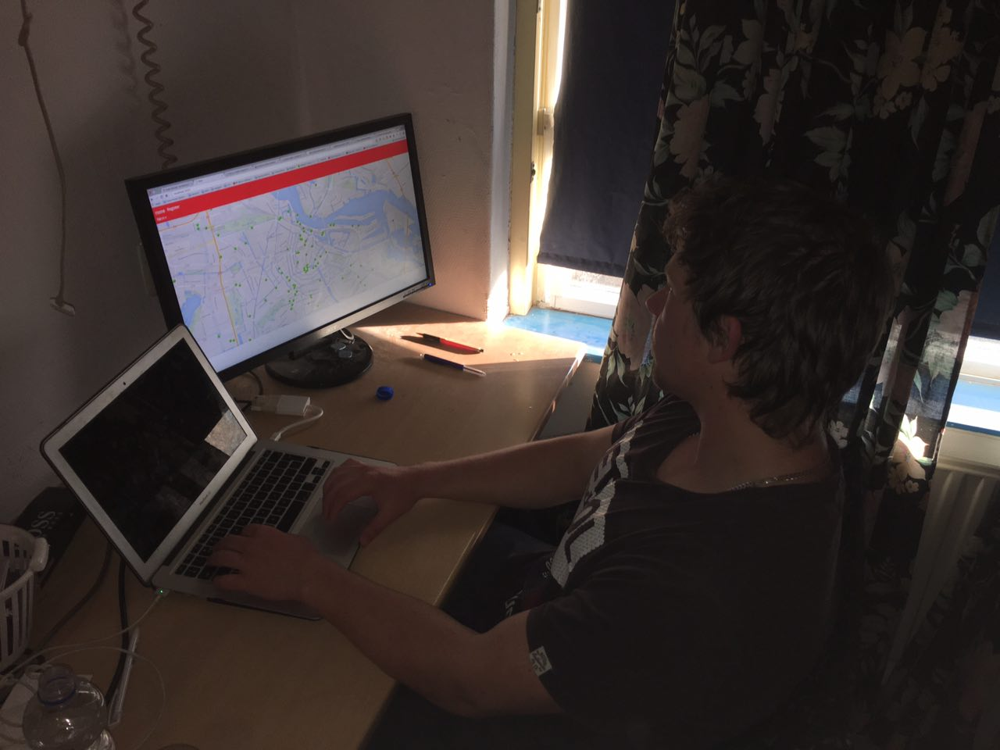
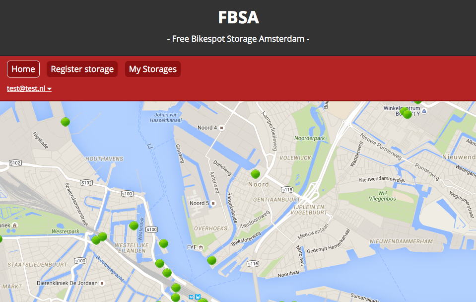

# Free Bike Spots Amsterdam

## Week 1

#### Assignment 3: Find a data resource for your project and describe its limitations

For this project I found a data resource for secured bicycle storages in Amsterdam. This resource can be found at:
http://open.datapunt.amsterdam.nl/ivv/parkeren/locaties.json.

##### Data source limitations
The API gives information about the locations of the storages, but it doesn't give information about the amount of bicycles that are stalled. For this meteor project prototype I therefore need to fake this information. Another limitation is that the API doesn't tell when it gets updated. The last time it has been modified is 2 months ago.

##### Data source advantages
The Gemeente Amsterdam is a reliable source for data resources.

##### Information

- **Owner**: Gemeente Amsterdam, afdeling Verkeer en Openbare Ruimte (info.vor@amsterdam.nl)
- **Contact**: Gemeente Amsterdam, afdeling Verkeer en Openbare Ruimte (info.vor@amsterdam.nl)
- **Last changed**: 23rd Dec 2015
- **API format**: JSON
- **Link**: http://data.amsterdam.nl/dataset/bewaakte-fietsenstallingen

#### Assignment 4: Describe the functionality of your app and which aspects will be reactive

##### Free bicycle spots (Concept)
For the first 24 hours, these bicycle storages allow you to stall your bicycle for free. The idea is to create a real time meteor app that shows these storages on a map. Here you'll be able to see if one of these storages has a free spot left for your bicycle to be stored. When a spot comes up, the user will be notified on its availability. In the ideal situation all storages should have some sort of system for checking bicycles in and out, but for this project I will create an admin panel where you can modify the total amount of stalled bicycles in your storage.

##### Target Audience

Amsterdam is top rated when it comes to the amount of cyclers. Everyday thousands of people cross the streets with their bicycles to go to work or school. They need a place to store their bike nearby these destinations. This app shows a clear view of the (nearby) locations of these storages and their directions.

##### MVP
The MVP is a real time meteor application. It consists out of a map with marked locations of bicycle storages. These marks are indicated with a colored bicycle-icon, based on the number of available spots in the bicycle storage. More information (such as an address, the name of the storage, possible costs etc.) on the storage will appear when clicking on these marks. The number of available spots in the  storage can be updated through an admin panel.

##### Reactiveness
- Storage marks wil change of color based on free spots (green, orange, red)
- When "following" storages, a notification will be send to the user if a spot is available

##### Wishlist
- Admin panel
- User login
- Map with storages
- Tooltip for storages with information (add, delete favorites)
- Notification when a free spot is available
- Favorite storages (add, delete)
- Show directions to closest available storage (GPS)

##### Features for MVP
- Map with storages
- Tooltip for storages with information
- Notification when a free spot is available

## Week 2

#### Assignment 1: Structure and organize files and directories according to Meteor standards

To fully use the module system and ensure that my code only runs when I ask it to, it's recommended that all of the application code should be placed inside the imports/ directory. This means that the Meteor build system will only bundle and include that file if it is referenced from another file using an import (also called “lazy evaluation or loading”).

See: http://guide.meteor.com/structure.html

## Week 3 (Final)

#### Final product

The final product is available at: [Free Bikespot Storages Amsterdam](http://37.139.5.136/)

#### User Interface

After building all of my application logic and structure I've asked my brother to test the application with a basic UI.
This UI wasn't user friendly at all, because only I could understand what this application really is.

**Here is a list of things I've added after doing this user test.**

- Added introduction text the first time you visit the app
- Added header information with logo and slogan to clarify meaning
- Styled menu items so they are better visible
- Added more space for fieldset in "Register Storage" and "Edit storage" page

